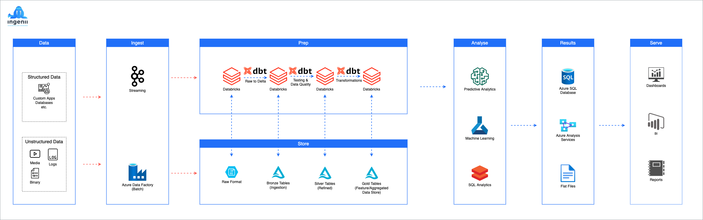

# Ingenii Azure Data Platform

## Development Guide

_Customer facing documentation can be found [here](./docs/user) or ideally on our [web portal](https://app.ingenii.io).



## Introduction

The data landscape today can be considered a rich ecosystem of tools and services. You no longer need to depend on expensive and proprietary technologies to collect and analyze data. Open source tools are as good, if not better, than commercial software. Cloud providers have made it easy to build cost-effective and scale on-demand solutions with zero capital investment. It has never been this easy to analyze data!

The solution you have in your hands is built to take advantage of the latest technologies.

At the core of the infrastructure, we have [Azure Databricks](https://docs.microsoft.com/en-us/azure/databricks/scenarios/what-is-azure-databricks) analyzing and processing data.
[Azure Data Factory](https://azure.microsoft.com/en-us/services/data-factory/) is responsible for data orchestration. [Azure Data Lake](https://azure.microsoft.com/en-us/solutions/data-lake/), alongside the [Delta Lake layer](https://delta.io), are providing us with infinite scale storage.

The platform support ingestion for structured, semi-structured, or unstructured data via numerous sources, some of which are: APIs, SFTP, Amazon S3, etc.

Last but not least, we have spent a lot of time thinking about how to automate the deployment of these tools and services. The current repository is the result of our hard work. We use Pulumi, GitHub Workflows, etc., to deliver a fully automated platform that is easy to deploy and maintain.

Our documentation section can help you navigate around and make yourself familiar with the platform.

## Getting Started

### Prerequisites

#### Easy Setup

- [Visual Studio Code](https://code.visualstudio.com/) + [devcontainers](https://code.visualstudio.com/docs/remote/containers)
- [Docker](https://www.docker.com/)

If you have the above requirements met, you can clone the repository and open it with VSCode using devcontainers.

#### Advanced Setup

If you don't want to use devcontainers, you need to install the packages below, before you can proceed:

- [Visual Studio Code](https://code.visualstudio.com/) or any IDE of choice.
- Python 3.9
- pip3
- Pulumi 3.18.0+
- Azure CLI 2.3.0+
- cruft 2.10.1+
- GNU make 3.81+

### Create a Development Environment

#### Clone the Azure Data Platform repository

```shell
git clone --depth 1 https://github.com/ingenii-solutions/azure-data-platform.git && cd azure-data-platform
```

#### Create a new development environment  

The new environment should be available under the `./dev` directory. Please keep in mind that the `src` directory inside `./dev` is actually a link to `./src`. This allows us to continue making changes in the `./src` directory whilst developing.

_The setup might take up to 5 minutes, depending on your internet speed and machine specs._

```shell
make setup
```


#### Set your credentials

```shell
cd dev && vi .env
```

#### Platform Deployment and Operation

Refer to the `README.md` file in the `./dev` directory on what `make` commands are available to you.

## References (TODO)

- Naming Conventions
- Configuration Schema
- Docker Images
