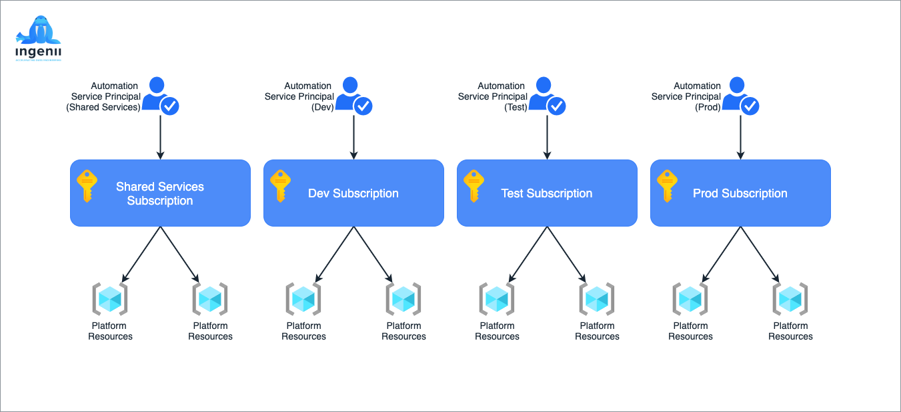
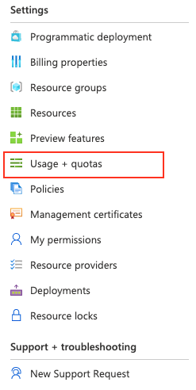
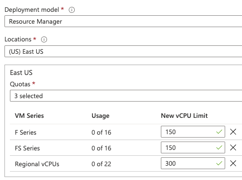
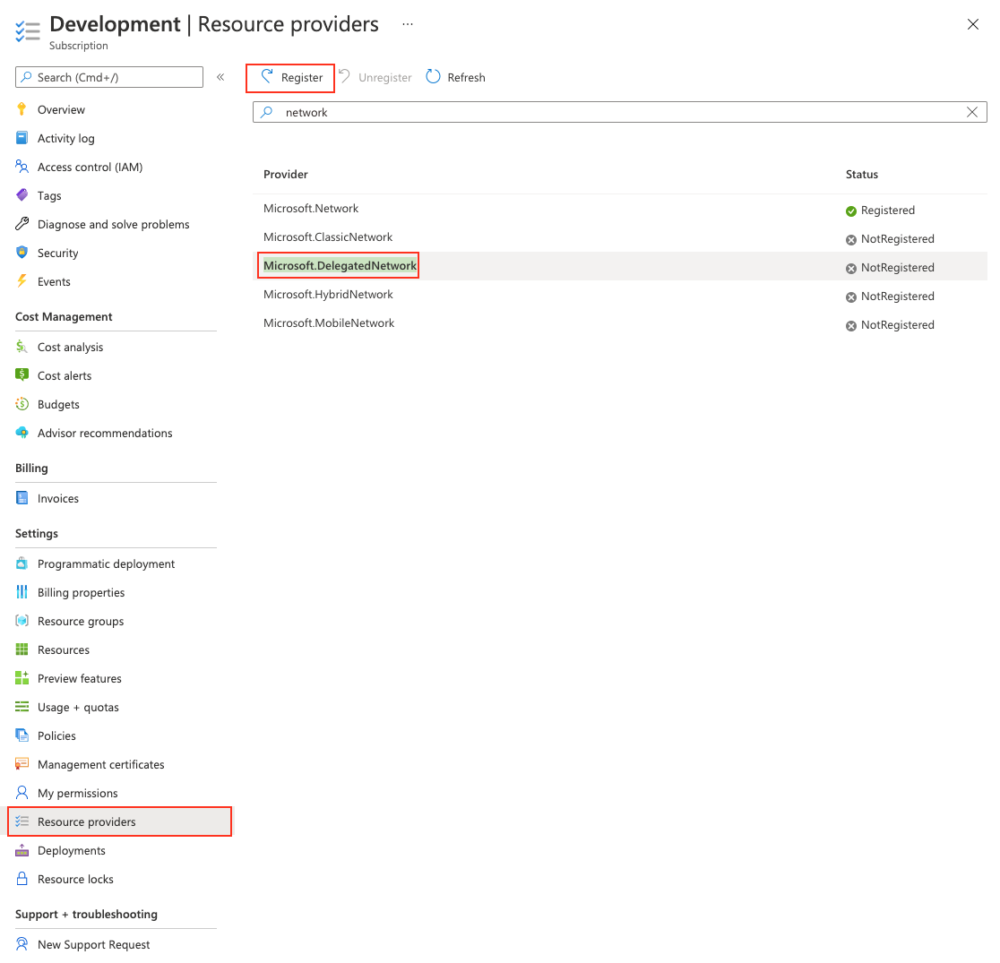

# Platform Requirements <!-- omit in toc -->

**Table of Contents**

- [1. Introduction](#1-introduction)
- [2. Azure Subscriptions](#2-azure-subscriptions)
  - [2.1 Create Azure Subscriptions](#21-create-azure-subscriptions)
  - [2.2 Quota Increase](#22-quota-increase)
  - [2.3 Resource Providers](#23-resource-providers)
- [3. Azure Service Principals](#3-azure-service-principals)
  - [3.1 Create Azure Service Principal](#31-create-azure-service-principal)
    - [Step 1 - Log in to the Azure CLI](#step-1---log-in-to-the-azure-cli)
    - [Step 2 - List All Subscriptions](#step-2---list-all-subscriptions)
    - [Step 3 - Specify Subscription](#step-3---specify-subscription)
    - [Step 4 - Create Service Principal](#step-4---create-service-principal)
  - [3.2 Assign Azure Active Directory Permissions](#32-assign-azure-active-directory-permissions)
    - [Step 1 - Grant API Permissions](#step-1---grant-api-permissions)
    - [Step 2 - Consent the API Permissions](#step-2---consent-the-api-permissions)
- [4. Azure DevOps](#4-azure-devops)
  - [4.1 Create Personal Access Token](#41-create-personal-access-token)
    - [Step 1 - Go to Azure DevOps portal](#step-1---go-to-azure-devops-portal)
    - [Step 2 - Click on your User icon at the top right corner](#step-2---click-on-your-user-icon-at-the-top-right-corner)
    - [Step 3 - Select "Personal access tokens"](#step-3---select-personal-access-tokens)
    - [Step 4 - Create a new token](#step-4---create-a-new-token)
- [5. Temporary Permissions](#5-temporary-permissions)
- [6. Additional Questions](#6-additional-questions)
- [7. Requirements Checklist](#7-requirements-checklist)

<div style="page-break-after: always; break-after: page;"></div>

---

## 1. Introduction

The consumer of this platform will have to complete specific pre-requisite steps to ensure all requirements are in place before the deployment can start.

<div style="page-break-after: always; break-after: page;"></div>

---

## 2. Azure Subscriptions



The platform requires four Azure Subscriptions to match the resource environments. Segregating environment resources in different Subscriptions provides better access and billing control.

- **Shared Subscription** - Contains resources for the Shared Environment
- **Dev Subscription** - Contains resources for the Dev Environment
- **Test Subscription** - Contains resources for the Test Environment
- **Prod Subscription** - Contains resources for the Prod Environment

> Note: It is possible to create all resources in the same Subscription. Ingenii does not recommend this approach unless this is the only viable option.

### 2.1 Create Azure Subscriptions

Please follow the [official Microsoft documentation](https://docs.microsoft.com/en-us/azure/cost-management-billing/manage/create-subscription) on how to create Azure Subscriptions.

Suggested Subscription Names

- **ADPShared**
- **ADPDev**
- **ADPTest**
- **ADPProd**

**ADP** stands for Azure Data Platform.

### 2.2 Quota Increase

> If your subscription type is different from Free Trial or Pay as You Go. You do not need to follow the quota increase steps.
> CSP and Enterprise agreement subscriptions have sufficient quota limits.

The new Azure subscriptions will have an imposed quota of how many instances can be running simultaneously.  
We need to request a quota increase for each subscription by following the process below:

Step 1

Go to the [Azure Portal](https://portal.azure.com) and open the **Subscriptions** pane.

Step 2

Locate the `Usage + quotas` pane and click on it




Step 3

Click on the `Request Quota Increase` button and choose the following options:

- What is your issue related to? - `Azure Services`
- Summary - `Quota increase`
- Issue type - `Service and subscription limits (quotas)`
- Subscription - One of the ADP subscriptions
- Quota type: `Compute-VM (cores-vCPUs) subscription limit increases`

Click Next to proceed

Step 4

Click on **Enter details** to provide details for the request.

A new pane with the title `Quota details` will pop up.

Select the locations (regions) you are requesting the quota increase. This is the region where your platform will be deployed.

Step 5

Populate the the new limit fields and submit the form.



It will take around 30 minutes or more for Microsoft to approve the quota increase.

### 2.3 Resource Providers

We need to enable the **Microsoft.DelegatedNetwork** provider for each subscription.

Click on **Subscriptions** -> **subscription name** -> **Resource providers** -> Search for **Microsoft.DelegatedNetwork** -> **Select** and click **Register**.



---

## 3. Azure Service Principals

A service principal is an application within Azure Active Directory. When created, the application generates authentication tokens. Terraform uses these tokens as a way to authenticate against Azure and deploy the infrastructure resources.

We need to create a Service Principal per Subscription.

Suggested Service Principal Names

- ADPSharedAutomation
- ADPDevAutomation
- ADPTestAutomation
- ADPProdAutomation

### 3.1 Create Azure Service Principal

The steps below outline the method of creating a Service Principal using the Azure CLI. You need to repeat the steps for each Service Principal.

#### Step 1 - Log in to the Azure CLI

```shell
$ az login
```

#### Step 2 - List All Subscriptions

```shell
$ az account list
```

The output should return all Subscriptions that we have created. Choose the Subscription that you are creating Service Principal for and make a note of the `id` value. That is the `Subscription Id`.

For this example, the Subsciprtion Id is `bd36c548-3b15-4570-ae81-08d9c4c480cb`. We will use that id in subsequent commands.

```json
{
  "cloudName": "AzureCloud",
  "homeTenantId": "360a8067-cf57-4e52-bacb-83702821f1f1",
  "id": "bd36c548-3b15-4570-ae81-08d9c4c480cb",
  "isDefault": true,
  "managedByTenants": [
    {
      "tenantId": "a27c5a35-9c0e-4b06-adb0-05e82f48947f"
    }
  ],
  "name": "ADPDev",
  "state": "Enabled",
  "tenantId": "360a8067-cf57-4e52-bacb-83702821f1f1",
  "user": {
    "name": "user@example.com",
    "type": "user"
  }
}
```

#### Step 3 - Specify Subscription

Tell the Azure CLI what Subscription Id we are operating with:

```shell
$ az account set --subscription="bd36c548-3b15-4570-ae81-08d9c4c480cb"
```

#### Step 4 - Create Service Principal

We are creating a new Service Principal called `ADPDevAutomation`, assigning it the role `Owner` to the Subscription `ADPDev` (bd36c548-3b15-4570-ae81-08d9c4c480cb).

```shell
$ az ad sp create-for-rbac --name="ADPDevAutomation" --role="Owner" --scopes="/subscriptions/bd36c548-3b15-4570-ae81-08d9c4c480cb" --years 1
```

> The Service Principal credentials will be valid for a year from the time we create them. You can increase the lifetime by setting the `--years` switch in Step 4 to a different value than 1.

The command will output values like these:

```json
{
  "appId": "b4dce5a6-c62a-4a6f-b6d6-110d695cab42",
  "displayName": "ADPDevAutomation",
  "name": "b4dce5a6-c62a-4a6f-b6d6-110d695cab42",
  "password": "mZ2Q0-j6manfKj5ZQJHSJSYhZnQSqaQPBY",
  "tenant": "a27c5a35-9c0e-4b06-adb0-05e82f48947f"
}
```

> **Please keep the values somewhere safe.**

Here is how they map to the Terraform credentials:

- `appId` is the `ARM_CLIENT_ID`
- `password` is the `ARM_CLIENT_SECRET`
- `tenant` is the `ARM_TENANT_ID`

We also need the subscription id from [Step 2](#step-2---list-all-subscriptions).

- `subscription` is the `ARM_SUBSCRIPTION_ID`

Make sure to save these credentials to a password manager. The Service Principal password will not be displayed again after you close the terminal window.

### 3.2 Assign Azure Active Directory Permissions

The Azure Data Platform creates Azure AD Groups and Azure AD Applications (Service Principals) as part of the deployment.

We need to grant access to our Service Principal to create Azure AD Groups and Applications.

#### Step 1 - Grant API Permissions

Navigate to the Azure Active Directory overview within the [Azure Portal](https://portal.azure.com) and select the [App Registrations](https://portal.azure.com/#blade/Microsoft_AAD_IAM/ActiveDirectoryMenuBlade/RegisteredApps) blade. You should see the Service Principals (applications) we have created. Click on the display name of the Service Principal you want to manage.

Go to the `API Permissions` blade and click `Add a permission`. In the new pane that opens, select `Azure Active Directory Graph` (under the Supported Legacy APIs subheading). **Do not select** "Microsoft Graph" as the Azure Terraform provider does not currently make use of it.

Choose `Application Permissions` for the permission type, and check the permissions below:

- `Application.ReadWrite.All`
- `Directory.ReadWrite.All`\*

These permissions will only allow us to create/manage Applications and Groups but not delete them.

> \* The 'Directory.ReadWrite.All' is considered high-level permission. Unfortunately, this is the only way to automate the Azure AD Group creation.  
> Alternatively - You can omit the 'Directory.ReadWrite.All' permission.
> We have a [script](https://github.com/ingenii-solutions/public/tree/main/scripts/data-platform/azuread-groups-creation) that you can review and use to create all necessary Azure AD Groups.

#### Step 2 - Consent the API Permissions

Once you have assigned the permissions, you will need to grant admin consent. This requires that you are signed to the Azure Portal as a Global Administrator.
Click the "Grant admin consent" button and confirm this action.

<div style="page-break-after: always; break-after: page;"></div>

---

## 4. Azure DevOps

Azure DevOps is used as a CI/CD platform by some of the Azure Data Platform services. (e.g., Azure Data Factory, Azure Databricks, Data Build Tool, etc.)

The Terraform provider for Azure DevOps currently supports authentication via Personal Access Tokens only.

### 4.1 Create Personal Access Token

#### Step 1 - Go to [Azure DevOps](https://dev.azure.com/) portal

> If you have never used Azure DevOps, you will have to sign up using your Microsoft credentials and create a new Organization.

#### Step 2 - Click on your User icon at the top right corner

#### Step 3 - Select "Personal access tokens"

#### Step 4 - Create a new token

Select `+ New Token` to open the Token Creation pane.

**Suggested Token Name**: ADPSharedAutomation

Set the expiration to 1 year or more. Match the expiration time to your Service Principal expiration time.

Click on `Scopes` and choose `Custom defined`.

> You might need to click on `Show more scopes` to see all scopes.

Select the following permissions:

**Agent Pools**

- [x] Read

**Build**

- [x] Read & Execute

**Code**

- [x] Full
- [x] Status

**Environment**

- [x] Read & Manage

**Graph**

- [x] Read

**Identity**

- [x] Read & Manage

**Member Entitlement Management**

- [x] Read & Write

**Project and Team**

- [x] Read, Write & Manage

**Secure Files**

- [x] Read, Create & Manage

**Security**

- [x] Manage

**Variable Groups**

- [x] Read, Create & Manage

Click `Create` to generate the new token.

Keep the token safe in your password manager.

---

<div style="page-break-after: always; break-after: page;"></div>

## 5. Temporary Permissions

The platform will be deployed automatically using the Service Principal credentials for each subscription.
Once the deployment is complete, the Ingenii team would require access to your Azure Portal to:

1. Verify the deployment
2. (Optional) Walk you through the deployed resources

A simple Azure AD user can be created and assigned the following permissions:

- `Owner` access to each of the four Azure subscriptions that you have created.
- `Project Admin` access to the Data Platform project in Azure DevOps

As soon as the deployment is verified, the temporary user can be disabled and deleted.

> Please note: The temporary user has to be a regular member of the Azure Active Directory. Guest users are not supported.

## 6. Additional Questions

- Which is the primary Azure region we should use for the deployment? - e.g. **UKSouth**
- What Azure VNET address space (CIDR) should we use?
  - We require 3x /16 (255.255.0.0) ranges. One for each environment (Dev, Test, Prod)
  - We require 1x /20 (255.255.240.0) range. Reserved for the Shared services environment.
- What resource prefix can we use? - The resource prefix will be added to every deployed resource. E.g. **`prefix`-resource-name**. For example, if your company name is **Fabrikam**, the prefix can be **fbrkm**. _The prefix is limited to 5 alphanumerical characters_.

## 7. Requirements Checklist

- **Azure Subscriptions**
  - [x] Shared
  - [x] Dev
  - [x] Test
  - [x] Prod
- **Azure Service Principals**
  - [x] Shared
  - [x] Dev
  - [x] Test
  - [x] Prod
- **Azure DevOps Personal Access Token**
  - [x] Shared
- **Additional Questions**
  - [x] Azure Region
  - [x] Azure VNET Address Space
  - [x] 3x /16 ranges
  - [x] 1x /20 range
  - [x] Resource Prefix
