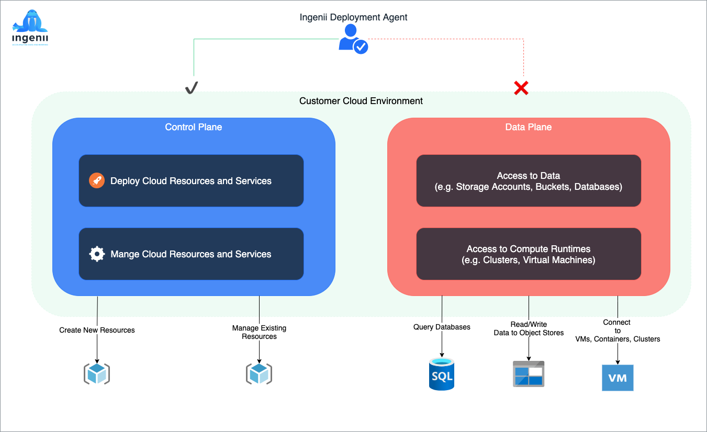
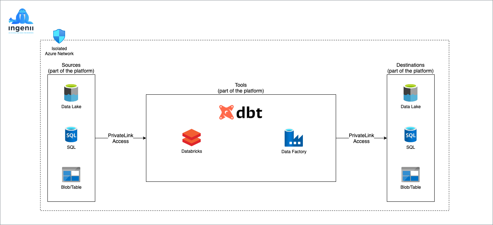
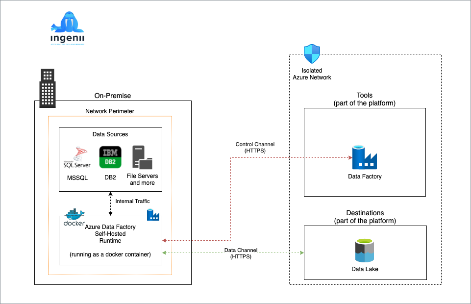

# Platform Security

- [Platform Security](#platform-security)
  - [Overview](#overview)
    - [Control Plane vs Data Plane Access](#control-plane-vs-data-plane-access)
  - [Exposed Services](#exposed-services)
  - [Role Based Access Control](#role-based-access-control)
  - [Service Accounts](#service-accounts)
    - [Subscription Access](#subscription-access)
  - [Network Firewalls and Authentication](#network-firewalls-and-authentication)
  - [Network Flow](#network-flow)
  - [Data Movement](#data-movement)
    - [Data Movement Within The Platform](#data-movement-within-the-platform)
    - [On-Premise To Cloud Using Azure Data Factory Self-Hosted Runtime](#on-premise-to-cloud-using-azure-data-factory-self-hosted-runtime)

## Overview

### Control Plane vs Data Plane Access

## Exposed Services

All of the Ingenii Data Engineering deployed resources are available through your cloud platform portal. The top level security

Azure Data Platform exposes the following additional end points:

- Databricks Workspaces - accessible via a web interface, each workspace will have its own URL and access to which
- Azure Data Factory
- Data Lake - DataBricks connects via private link, but ADF goes via a public link (Microsoft limitation, until it the ADF private links)
  - Trusted Services
- Azure DevOps - own URL

## Role Based Access Control

All user controls are done through Azure AD and role assignments. There are three roles that the Azure Data Platform solution requires:

| role     | usage                                                                              |
| -------- | ---------------------------------------------------------------------------------- |
| admin    | overall admin rights to all of the platform                                        |
| engineer | who will be managing the data connectors, pipelines and storage                    |
| analyst  | who will effectively be working with the analytics workspaces, tools and notebooks |

You can assign any Azure AD user to one or more of these roles.

## Service Accounts

### Subscription Access

## Network Firewalls and Authentication

## Network Flow

## Data Movement

There are numerous ways to move data in or out of the data platform. 

### Data Movement Within The Platform

### On-Premise To Cloud Using Azure Data Factory Self-Hosted Runtime

