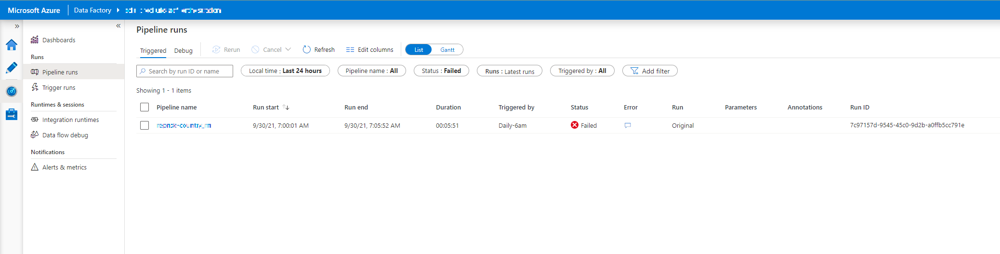
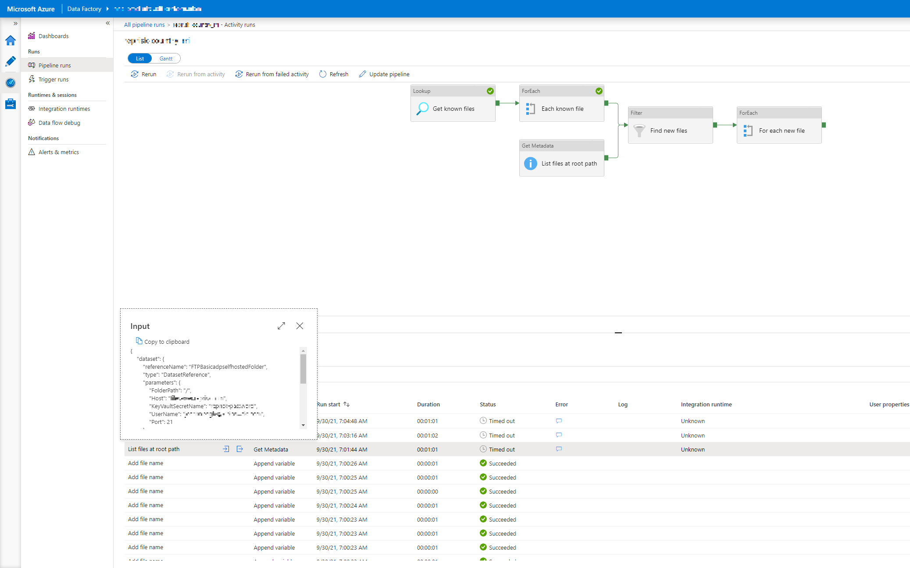
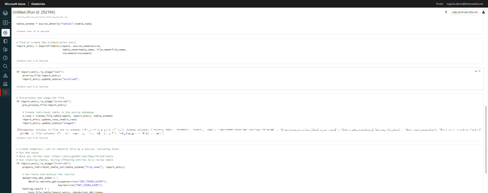

# Data Factory Pipeline Errors

If there is an error on a Data Factory pipeline, then any email address set to receive alerts will be notified with an email similar to the one above. Please note that since the alerts work on a metrics basis, an email is sent if there are any failures in a timeframe. This means that one email could represent several pipeline failures.
To see the details of which pipeline failed either click on the 'Affected resource'  link in the email or log into the [Azure Portal](https://portal.azure.com), access the relevant Data Factory, and open the Data Factory Studio.

Go to the ‘Monitor’ tab to see all the pipelines. Filter the ‘State’ column to ‘Failed’ to find the pipeline(s) with issues.

Clicking on the icon in the ‘Error’ column will give the error message that stopped the pipeline. Click on the Pipeline name on the left to take you to the pipeline details so we can identify the exact cause of the error.

In this case, connecting to the SFTP server to see what files are available timed out. This is likely a transitory issue, and so running the pipeline again may be all that’s needed. Go back to the ‘Monitor’ page.
   

If you hover over the pipeline name you can see the icon to re-run the pipeline. In this case, re-running the pipeline was all that was needed, and the re-run version succeeds.

## Error in the Databricks Data Pipeline

If there is an error in the Databricks data ingestion pipeline, the same error message from Data Factory will occur. The error will be on the pipeline `Trigger ingest file notebook`

On the Error details we'll see a link to the Databricks job that threw the error. You'll need to be a member of the respective Engineering AAD group (ADP-Dev-Engineers, ADP-Test-Engineers, ADP-Prod-Engineers) in order to access it.

This will take you to the Databricks workspace, and the specific run of the pipeline that failed to investigate the exact error message. usually, the error arises from misconfiguration, but if you think there is an issue with the pipeline itself please get in touch with us at [support@ingenii.dev](mailto:support@ingenii.dev).

In a different case below, the file has a column which isn't in the schema, and so the pipeline stops. The fix here would be to update the schema file in the data engineering repository, and then re-trigger the ingestion pipeline.

