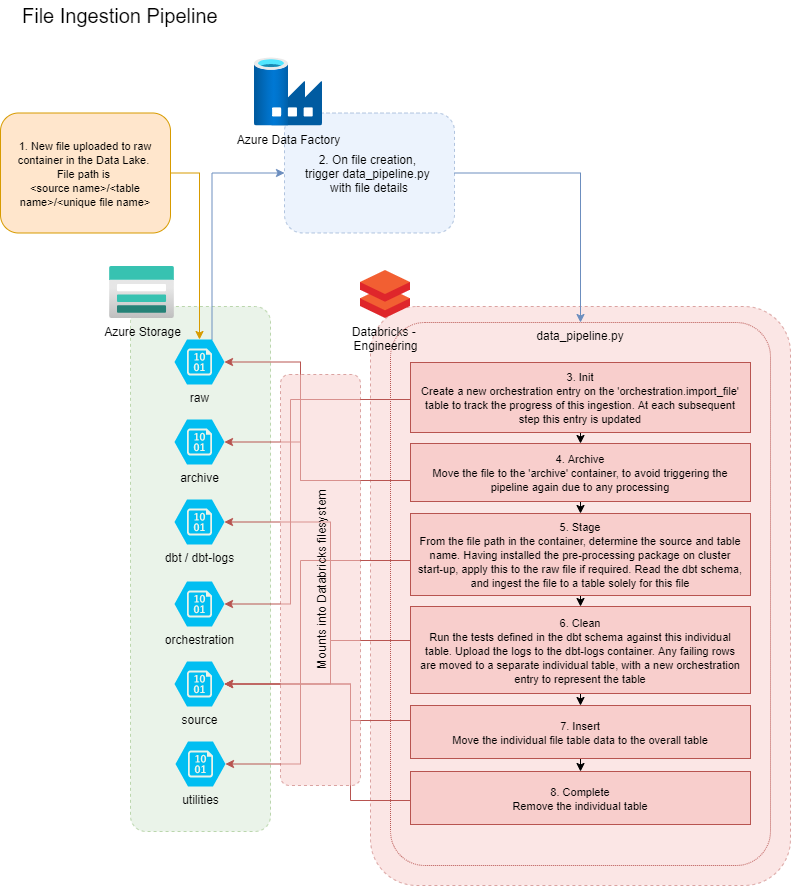

# File Ingestion Pipeline

In the below diagram we detail the steps that occur on the different Azure resources when we ingest a new file into the data platform.

More details about the pipeline functionality can be found in:

1. [Azure Data Platform Databricks Runtime](https://github.com/ingenii-solutions/azure-data-platform-databricks-runtime)
1. [Azure Data Platform Data Engineering example repository](https://github.com/ingenii-solutions/azure-data-platform-data-engineering-example)

