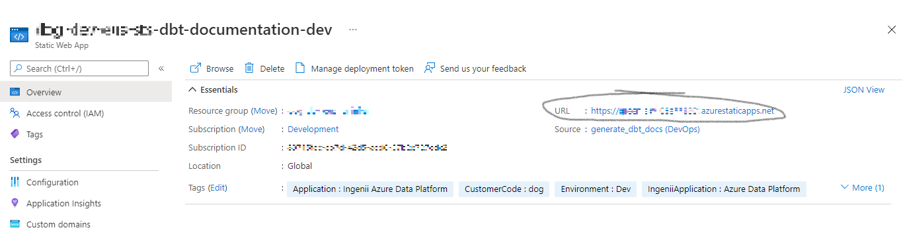

# dbt Documentation

Part of the capablities of `dbt` is the [`dbt docs generate`](https://docs.getdbt.com/reference/commands/cmd-docs) command, which will take the `dbt` configuration and current state of the database and generate documentation, in the form of a website, to make it easier to explore the current state of the data. The generation of this documentation is handled as part of the CI/CD process in the [Ingenii Data Engineering repository](https://github.com/ingenii-solutions/azure-data-platform-data-engineering-example); however the infrastructure to host the resulting documentation and configuration to make it possible for the CI/CD process is handled here.

## Infrastructure created

By default, this site is disabled. It can be enabled on a per-environment (DTAP) basis with this addition to the relevant configuration `.yml`:

```yaml
analytics_services:
  dbt:
    documentation:
      enabled: true
```

This will create an Azure Static Web App, and put in place the configuration for the CI/CD processes as described above.

## Access to the site

On the Static Web App resource itself you'll be able to see the default URL generated for the site, from which you can view the documentation:



By default, no users wll have permissions to view the site and you will receive a 401 message. Our hope would be to assign an AAD group to the site so everyone within this group has access, but this is not possible; at the moment users have to be individually invited.

The Azure guide to inviting users [can be found here](https://docs.microsoft.com/en-us/azure/static-web-apps/authentication-authorization?tabs=invitations#role-management), however this is affected by the configuration of the site, which is defined in the `dbt/docs/staticwebapp.config.json` file in your Data Engineering repository.
1. The possible roles for the site are defined in the `routes` list, where `"route": "/*"`. By default the only role available is `reader`, so in inviting a user you only need to give them the `reader` role.
2. Also by default the only available `Authorization provider` is `Azure Active Directory`. This is also set in the `routes` object, by changing the redirected path of the `/login` route; please see [the Azure documentation here](https://docs.microsoft.com/en-us/azure/static-web-apps/authentication-authorization?tabs=invitations#login).
3. If you have added a custom domain that you want people to use, it should be specified here.


## Custom domains

Custom domains can be managed through the configuration `.yml`. For example:

```yaml
analytics_services:
  dbt:
    documentation:
      enabled: true
      custom_domains:
      - domain: documentation.ingenii.dev
```

Validation comes in two forms: CNAME or TXT, and by default CNAME. For CNAME validating the presense of a CNAME record on the customer side happens when we create the custom domain, causing the deployment to fail if it does not exist. However, the creation of the CNAME record can't happen until ater the Static Site is deployed so we know which URL to point the record at. See [the Azure documentation of how to create a custom domain here](https://docs.microsoft.com/en-us/azure/static-web-apps/custom-domain?tabs=azure-dns#add-domain-using-cname-record-validation), but the steps we need to follow are:
1. Deploy the `dbt` documentation site with no custom domains configured
2. Take the Static Site URL to create the relevant CNAME entries for the custom domains
3. Add the custom domains to this cofiguration, and deploy
